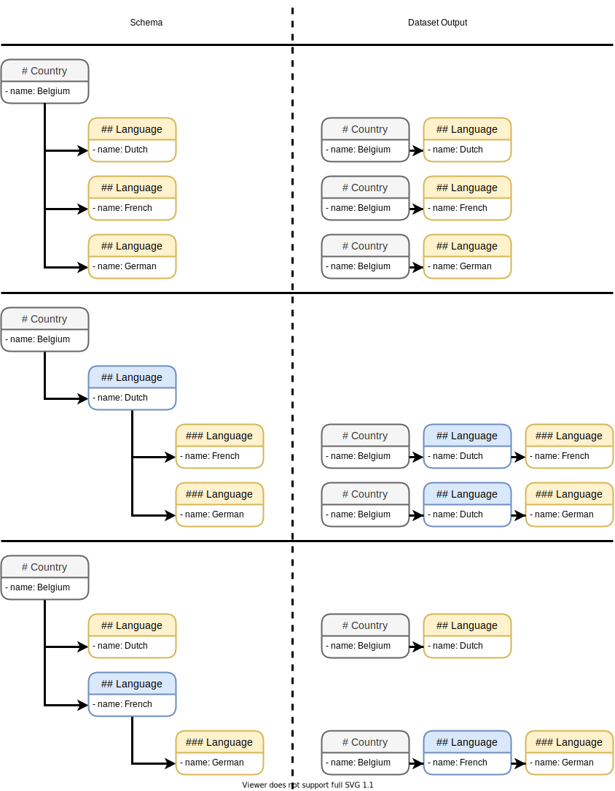

# Entry

Entry is a collection of variables.
An entry name is proceeded by one or multiple pound signs `#`, in the form of:

```markdown
# <entry name>
- <key 1>: <value 1>
- <key 2>: <value 2>
...
- <key n>: <value n>
```
`# Example` in previous examples are Level-1 Entries, as denoted by the single leading pound sign.
All Markdata files must start with a Level-1 Entry, and contains exactly one Level-1 Entry.

Entries are useful when describing an object with multiple attributes:

```markdown
# Country
- name: Belgium
- capital: Brussels
- population: $11433256$
- euro zone: `TRUE`
```

<EditorLite item="entry1" />

Let's add some annotations.
```markdown
# Country
- name: Belgium
  > short for the Kingdom of Belgium
- capital: Brussels
- population: $11433256$
  > data from 2019; retrieved from World Bank
- euro zone: `TRUE`
  > joined in 1999
```

<EditorLite item="entry2" />

Entries should have local unique keys.
The following code will raise error:
```markdown
# Country
- name: Belgium
- language: Dutch
- language: French
- language: German
```
::: details Known Issue
The current parser don't check for duplicate keys, so technically this is still valid.
This rule will be enforced in future versions.
:::

## Subentry

Entries can be nested, and the level of the entry is denoted by the number of leading pound signs.
So a Level-1 Entry takes the form of `# <Level 1 Entry Name>`, and a Level-2 Entry takes the form of `## <Level 2 Entry Name>`, and so forth.

Examples:
```markdown
# Country
- name: Belgium

## Language
- name: Dutch

## Language
- name: French

## Language
- name: German
```
<EditorLite item="entry3" />

The `# Country` entry has one variable `name` and three Level-2 child entries `## Language`.
The three `## Language`  subentries are also known as the *terminal nodes* as they do not contain any subentry.
When compiling the dataset, the parser look for all terminal nodes in the Markdata file and flatten the data structure.
Thus the previous example produces a dataset with three rows (one for each terminal node) and two columns (one of each variable).

Note that the variable keys are scoped, so `## Offical Language` is allowed to have a variable with the key `name`.

Level-2 Entries can only be nested in a Level-1 Entry, and Level-3 Entries can only be nested in a Level-2 Entry, and so forth.
Compare the following two examples with the previous one:
```markdown
# Country
- name: Belgium

## Language
- name: Dutch
  > This is a Level 2 Entry

### Language
- name: French
  > This is a Level 3 Entry

### Language
- name: German
  > This is a Level 3 Entry
```
<EditorLite item="entry4" />

```markdown
# Country
- name: Belgium

## Language
- name: Dutch
  > This is a Level 2 Entry

## Language
- name: French
  > This is a Level 2 Entry

### Language
  > This is a Level 3 Entry
- name: German
```

<EditorLite item="entry5" />

A visualization of the differences between the three schemas are as follows:




A level can contain subentires of differenct classes:

```markdown
# Country
- name: Belgium

## City
- name: Brussels

## Language
- name: Dutch
```

<EditorLite item="entry6" />

Also, entries of the same class need not have identical variables, nor the same variable order.
```markdown
# Country
- name: Belgium

## Language
- name: Dutch
- size: $0.59$

## Language
- size: $0.4$
- name: French

## Language
- name: German
```


<EditorLite item="entry7" />

Observe that the order of the variables are preserved by default, and so the dataset produced is not too useful.

To check whether each entry contains the required variables and the correct orders, we need to specify its schema.
